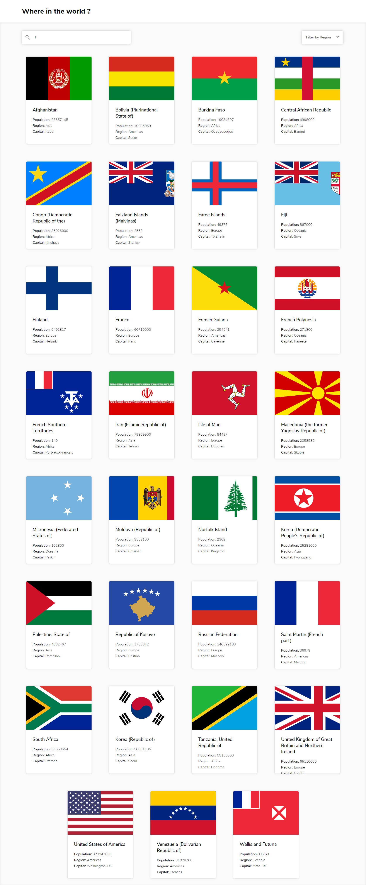

# Frontend Mentor - REST Countries API
  

### The challenge

Users should be able to:

- See all countries from the API on the homepage
- Search for a country using an `input` field
- Filter countries by region
- Click on a country to see more detailed information on a separate page
- Click through to the border countries on the detail page

### Screenshot

Computer view

Mobile view

### Built with

- HTML5
- CSS
- Javascript
- Flexbox

### What I learned

I learned how to make a search bar. I also improved my knowledge about creating dynamic content.